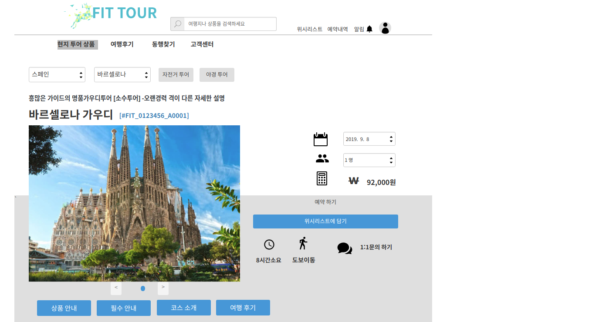
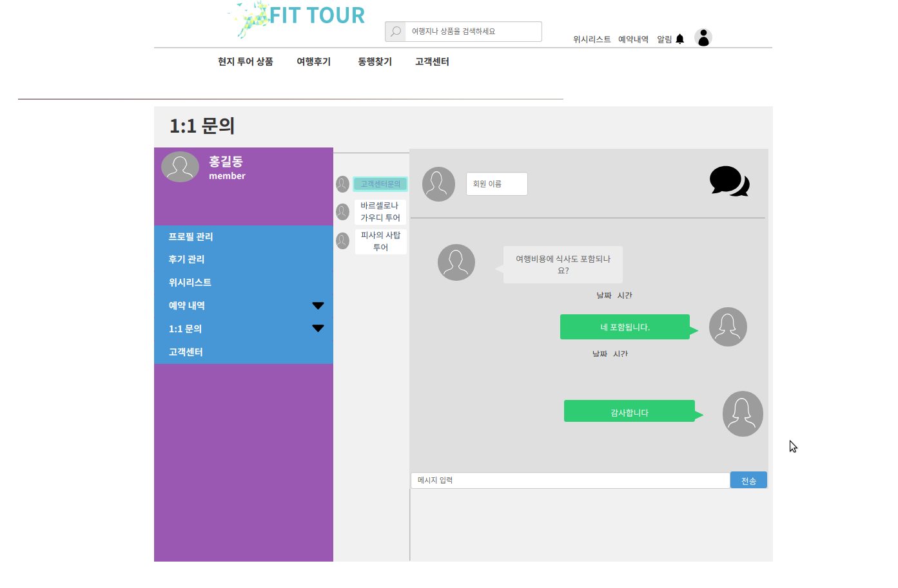

## uc001 question & answer(1:1문의하기)
    - 고객(회원)은 로그인을 한 후 메인 페이지에서 현지 투어 여행 상품 탭을 클릭한 후 1:1 문의하기 버튼을 클릭한다.
    -고객(비회원)은 회원가입을 한 후 로그인을 해야만 1:1문의를 할수 있다.

## 주액터
    - 고객(회원,비회원)

## 사전조건
1. 회원가입이 되어 있어야 한다.
- 회원가입을 한후 로그인을 한다.
- 현지 투어 여행상품 페이지에서 1:1문의하기 버튼을 클릭한다.

/

## 종료조건
- 현지 투어 여행삼풍을 누른후 1:1 문의하기 버튼을 클릭하고 가이드에게 문의할 내ㅇ용을 입력한후 전송 버튼을 누르면 된다.

## 1:1 문의하기 기본
1. 고객(회원)
- 메인페이지에서 로그인 하기 버튼을 클릭한다.
- 현지 투어 상품 베너를 클릭한다.
- 여행 상품에 관한 문의 사항을 1:1문의하기 버튼을 클릭하여 남긴다.
- 전송 버튼을 클릭하여 가이드에게 문의사항 메시지를 전송한다.

## 시나리오
1. 고객(비회원)
- 메인페이지에서 회원가입 버튼을 클릭한다.
- 회원가입을 한후 로그인 버튼을 클릭해서 로그인을 한다.
- 현지 투어 상품 베너를 클릭한다.
- 투어 상품에 대한 문의사항을 1:1 문의하기 버튼을 클릭해서 가이드에게 전송한다.
- 비회원인 경우에는 회원가입을 하지 않으면 후기를 조회하는 것만 할수 있다.

## 예외처리
1. 고객이 1:1문의하기 버튼을 클릭해서 가이드에게 문의사항을 남겼는데 그 전송한 문의사항이 가이드에게 전송되지 않은 경우
- 가이드에게 문의사항이 전송되지 않았습니다. 다시 작성해주세요 라는 메시지를 발생시킨다.

