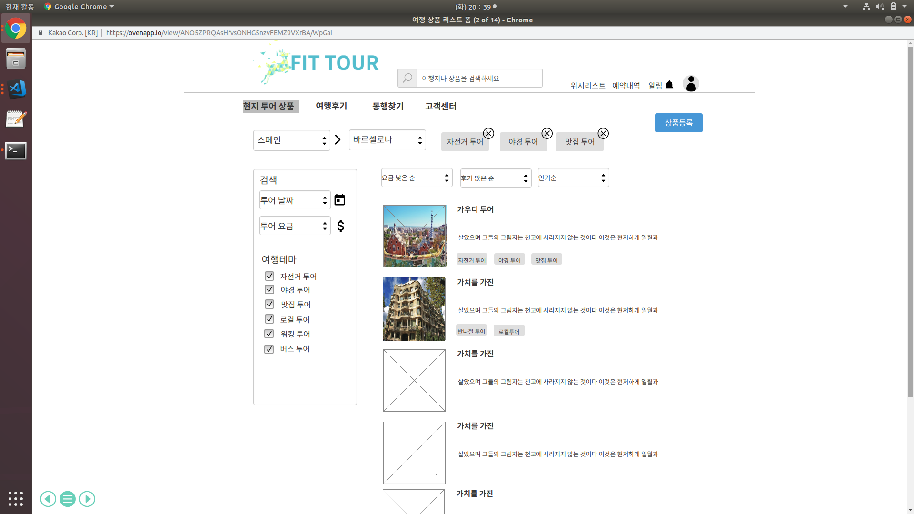
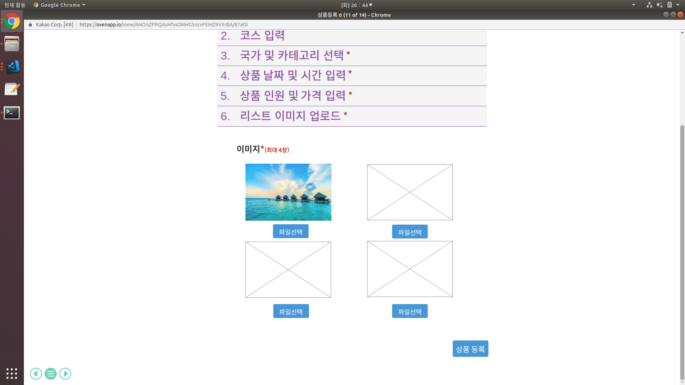
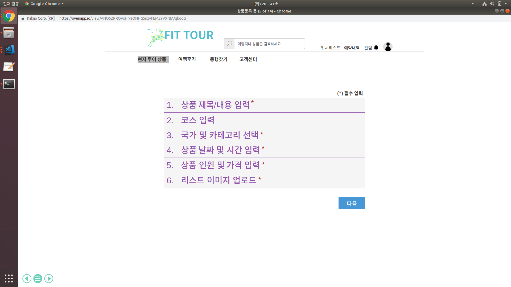
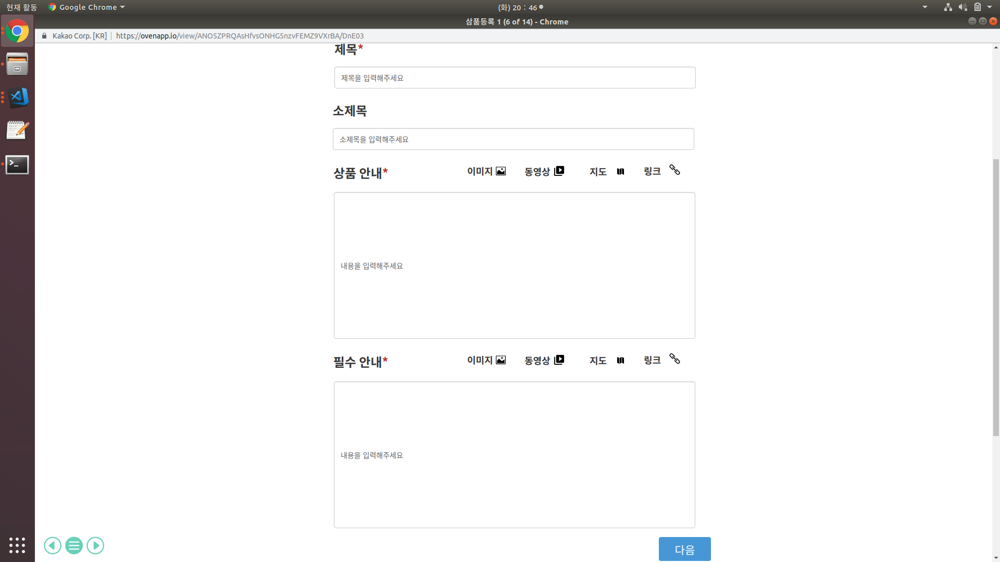
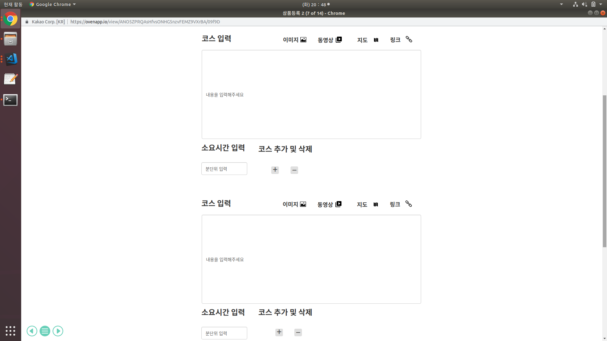
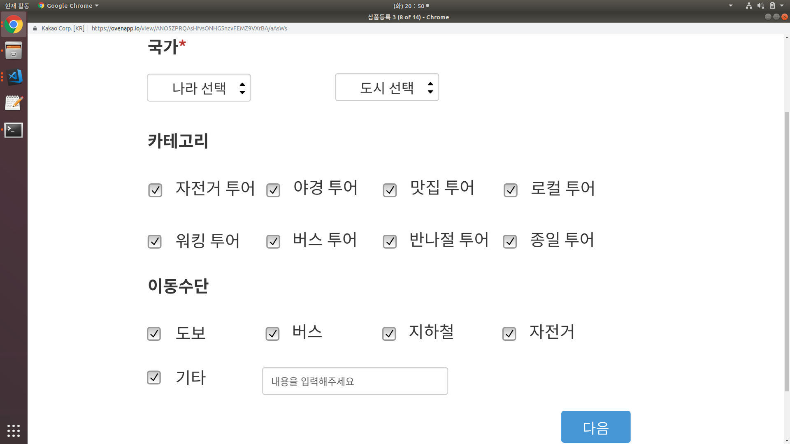

## uc001- 여행 상품 등록(travel product add)
- 관리자가 여행 상품을 등록할수 있는 페이지

## 주 액터
- 기업

## 사전 조건
- 해외 여행 상품을 판매하는 기업이  fit tour 홈페이지에 접속해서 
- 현지 투어 상품 배너를 클릭한후 상품등록 버튼을 클릭한다.\

## 종료 조건
- 여행 상품 등록 페이지에 있는 6개의 카테고리 
- (상품 등록/내용 입력, 코스 입력, 국가 및 카테고리 선택, 상품 날짜 및 시간 입력,
- 상품 인원 및 가격 입력, 리스트 이미지 업로드)
- 항목 중 필수 입력 항목이 아닌 '코스 입력' 폼을 제외한 나머지 5개 항목
- 즉 (상품 제목/내용 입력, 국가 및 카테고리 선택, 상품 날짜 및 시간 선택, 
- 상품 인원 및 가격 입력, 리스트 이미지 업로드)
- 5개 항목을 접부 입력하고 상품 등록 버튼을 클릭하면 상품이 등록된다.\

## 상품 등록 기본
-   '현지 투어 상품' 탭을 누르고 상품 등록 버튼을 누르면 여행상품 등록 페이지로 넘어간다.
- '여행 상품 등록'페이지에서 나오는 첫 화면은 상품 등록/내용 입력, 코스 입력, 국가 및 카테고리 선택, 상품 날짜 및 시간 입력, 상품 인원 및 가격 입력, 리스트 이미지 업로드 이렇게 6개의 항목이 나열되어 있는 페이지가 나온다.
- 선택입력 항목인 코스입력 항목을 제외한 나머지 항목을 모두 입력한후 상품 등록하기 버튼을 클릭한다.

## 시나리오
1. 상품 제목/내용 입력\
1.1필수 항목 모두 입력 했을 경우 다음 버튼을 클릭한다.
    - 필수 항목을 모두 입력하지 않은 경우 다음 버튼을 클릭하면 '필수 항목을 모두    입력해 주세요'라는 메시지가 뜬다.
    - 두번째 입력 항목은 필수 가 아니므로 고객이 버튼을 클릭하면 입력할 수 있는     창이 열린다.
    - 두번째 입력 항목을 입력하지 않고 바로 세번째 입력항목으로 넘어 갈 수 있다.\

2. 코스 입력
2.1 코스 입력 항목을 입력 하지 않는 경우
- 필수 입력 항목인 상품 제목/내용 입력 항목을 모두 입력 하고 코스 입력 항목은 선택 항목 이여서 입려을 안해도 된다.
- 코스 입력 항목을 입력하지 않으면 3번 입력 항목인 국가 및 카테고리 선택 입력       항목으로 넘어간다.

2.2 코스 입력 항목을 입력하는 경우\
2.2.1 이미지, 동영상, 지도, 링크 왁 같은 항목을 사용해서 코스의 내용을 입력한다. \
2.2.2 소요 시간 입력
한개의 코스를 도는데 걸리는 소요 시간을 입력한다.
2.2.3 코스 추가 및 삭제
전체 코스 입력 항목 중 추가 해야하는 코스가 있으면 '코스 추가' 버튼을 눌러서 코스를 추가 할수 있다.
2.2.4  2.1에서 입력한 코스 입력 항목중 삭제 해야하는 항목이 있다면 삭제 버튼을 눌러서 삭제 하고자 하는 코스를 삭제 할 수 있다.
2.2.5. 코스 입력을 완료한후 '다음' 버튼을 클릭하면 3번쨰 입력 항목인 '국가 및 카테고리 선택' 입력 항목으로 넘어간다.

3. 국가 및 카테고리 선택
- 코스 입력 항목에서 국가 항목(나라 선택, 도시 선택) 항목은 필수이다.
- 투어의 종류를 선택하는 자전거 투어, 야경 투어, 맛집 투어, 로컬 투어, 워킹 투어, 버스 투어, 반나절 투어, \
종일 투어 중 하나는 필수 로 선택해야 한다.
 - 이동 수단 선택 항목 (도보, 버스, 지하철, 자전거) 선택 항목 중에서 해당하는 항목이 있으면 한개 이상 필수로 선택한다.
 - 만약 이동 수단 선택 항목 중에서 해당하는 항목이 없으면 기타 항목에 채크하고 이동 수단 항목을 입력한다.
 - 이동 수단 항목 입력이 완료되면 '다음' 버튼을 클릭한다.
 - 단, 여행 카테고리와 이동 수단 항목에서 각각 1개이상은 무조건 필수로 선택 해야    한다. 
 - 만약 각 항목별 선택지에서 최소 한개의 항목이라도 선택하지 않으면 '다음'버튼을 클릭해도 넘어갈수 없다.

 4. 상품 날짜 및 시간 입력
 - 기업이 등록하려는 여행 상품의 여행 날짜와 총 여행의 소요 시간을 입력한다.

 5. 상품 인원 및 가격 입력
 - 해당 여행 상품에 참여하는 총 인원을 입력하고 
 - 인원 1인당 지불 해야하는 여행 가격을 입력한다.

 6. 리스트 이미지 업로드
 - '현재 투어 여행 상품' 배너를 클릭 했을 때 처음으로 나오는 여행지 사진을 등록할수 있다.
 - 여행지 사진은 최대 4장까지 입력할수 있다.
 - 단 한개의 사진은 무조건 필수로 등록해야 한다.
 - 사진을 등록하기 위해 파일 선택 버튼을 클릭해서 사진을 업로드 한다.
 - 사진 업로드를 완료한 후 상품 등록 버튼을 클릭해서 상품 등록을 완료 한다.

 7. 상품 등록이 완료되면 해당 상품을 현지 투어 상품 페이지에서 확인 할수 있다.

 ## 예외 처리
 - 필수 입력인 항목에서 입력하지 않은 항목이 있는데 다음 버튼을 눌러서 다음 화면으로 이동 하려는 경우
 - 이때는 필수라고 표시된 모든 항목을 입력해주세요 라는 메시지를 띄운다.
 - 고객이 필수로 표시된 모든 항목을 전부 입력해야 다음 입력 화면으로 넘어갈수 있도록 한다.
 - 여러개의 항목 중에서 한개를 선택하는 항목에서 하나라도 선택하지 않으면 다음 버튼을 눌러도 다음 입력 폼으로 넘어가지 못하게 한다.
 - 만약 최소 한개의 항목이다로 선택하지 않았는데 넘어가려고 하는 경우 '최소 한개의 항목이라도 선택해주세요' 라는 메시지를 띄운다.
 - 날짜를 입려하는 항목에서 현재 날짜보다 지난 날짜를 입력하는 경우 경고 메시지를 띄운다.
 - 오늘(현재)날짜를 기준으로 과거의 날짜는 선택할 수 없도록 한다.
 - 고객이 모든 입력 항목을 입력하고 상품등록 버튼을 클릭하려는데 필수 항목중에서 입력하지 않은 항목이 있다면
 -마지막에 상품등록 버튼을 누르더라도 "필수 입력 항목 중 입력 하지 않은 항목이 있습니. 필수 항목은 모두 입력해주세요" 라는 메시지를 띄운다.
 - 사용자가 모든 필수 항목을 올바른 형식으로 입력했을 경우에만 상품 등록 버튼을 클릭했을 때 상품이 등록 될수 있도록 한다.

 
 

