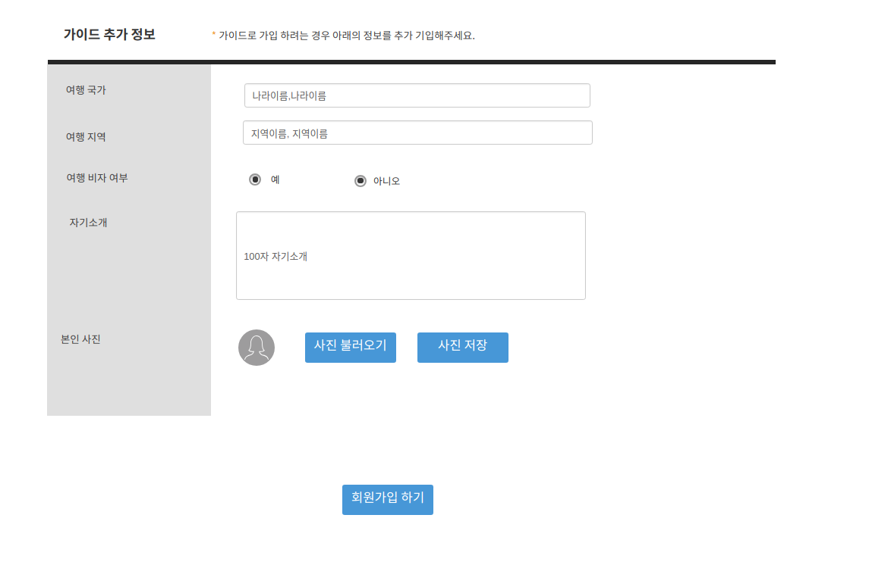

##uc001-sign in(회원가입)
    - 고객이 일반 사용자로 회원 가입을 할수 도 있고 일반 사용자겸 가이드로 가입할 수도 있다.\
    
## 주액터
- 고객

## 사전 조건
- 메인 페이지에서 회원 가입 버튼을 클릭한다.

## 종료 조건
- 회원 가입에 필요한 정보를 입력한 후 회원 가입 하기 버튼을 클릭한다.

## 회원 가입 기본
- 메인 페이지에서 회원 가입하기 버튼을 클릭한다.

## 시나리오
1. 고객이 회원 가입을 작성할 때 일반 정보만 작성하는 경우
- 선택 정보는 작성하지 않아도 된다.
- 일반 정보의 항목은 필수이므로 빠짐없이 작성해야 한다.
- 일반 정보만 입력하면 가이드가 아닌 일반 회원으로 가입된다.

2. 고객이 회원 가입 정보를 작성할 때 선택 정보도 작성하는 경우
- 선택정보는 필수 가 아니므로 의무적으로 작성할 필요는 없다.
- 하지만 작성하는 경우 마이페이지의 회원 정보에 추가로 입력한 정보까지 보여지게 된디.

3. 고객이 일반 회원 과 가이드로 활동을 하기위해 가이드 가입 정보도 입력하는 경우
- 일반 정보와 가이드 정보를 모두 입력해서 가입한 회원은 일반 회원과 가이드로 활동할수 있다.
- 가이드로 활동하지 않고 일반 회원으로 만 활동하고 싶을 때는 마이페이지의 회원정보 수정에서 가이드로 가입한 정보를 삭제하면 일반 회원으로 활동할 수 있다.

## 예외 흐름
1. 고객이 필수 입력사향인 일반 정보를 제대로 입력하지 않았는데 회원가입이 되는경우
- 회원가입하기 버튼을 클릭해도 필수 입력정보는 모두 입력해주세요 라는 메시지가 뜨게 한다.

2. 고객이 일반 회원가 가이드로 활동 하려고 둘 다 가입 정보를 입력했는데 한쪽 항목의 가입정보가 저장되지 않은경우
- 입력하신 정보를 다시 확인 부탁드립니다. 라는 메시지가 뜨게 한다.

3. 고객(비회원)이 회원가입을 완료하고 로그인을 하려고 입렸했는데 id나 비밀번호가 맞지 않는다고 나오는경우
- id와 비밀번호가 맞지 않으니 다시 올바르게 입력하라고 로그인 창으로 돌려 보낸다.
- 다시한번 입력했는데도 오류가 발생하는 경우 고객이 id를 찾거나 비밀번호를 재설정 할 수 있도록 로그인 하는 화면 밑에 id 찾기 와 비밀번호 재설정하기 버튼을 배치해 놓는다.

