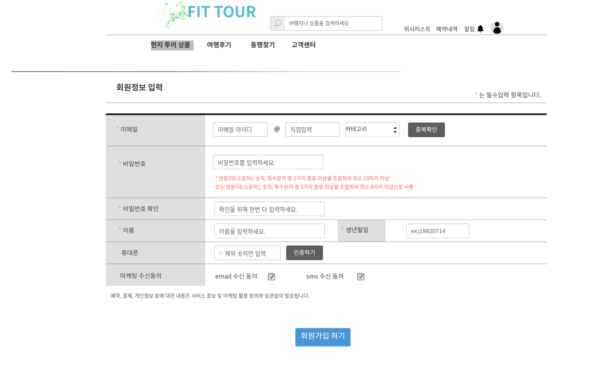

## uc001 회원가입(sign up)
- 여행 사이트를 이용하려는 고객이 회원가입을 한다.

## 주액터
- 고객

## 사전 조건
- 회원가입이 되어 있지 않은 고객이어야 한다.

## 회원가입 기본
- 회원가입이 되어져 있지 않은 고객이 메인페이지에서 회원가입 버튼을 눌러서 회원가입을 한다.

## 종료조건
- 회원가입 양식에 맞게 작성한후 회원가입하기 버튼을 클릭한다,

## 시나리오
- 고객이 메입페이지에서 회원가입 버튼을 클릭한다.
- 회원가입 양식에 맞게 작성한후 회원가입하기 버튼을 누른다.

## 예외발생
1. 회원가입 버튼을 눌렀는데 회원가입이 되지 않는경우
- 회원가입 양식에 맞게 다시 입력해주세요 라는 메시지가 발생되게 한다.

