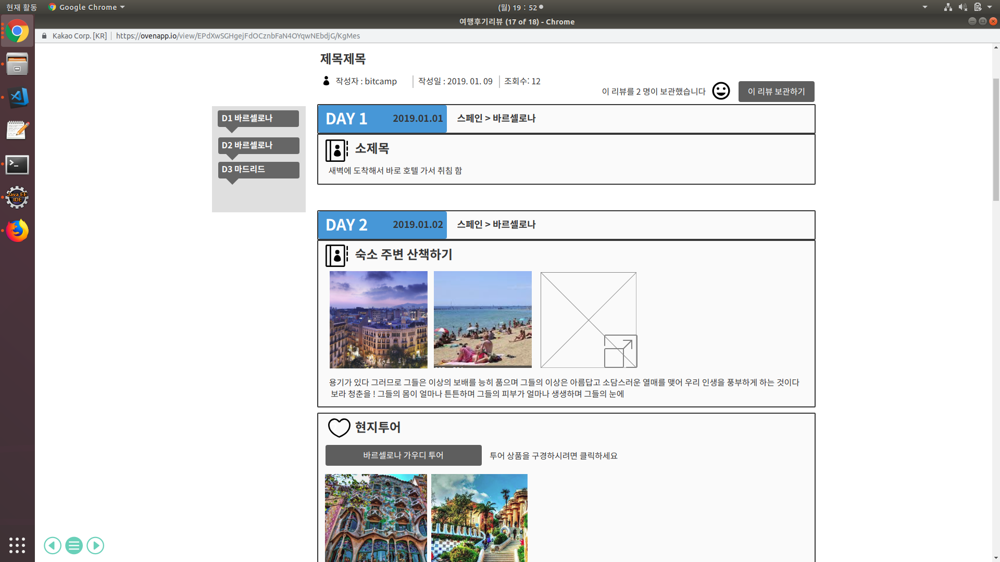

## uc001-여행 후기 조회(travel product detail)
고객이 여행 후기 사진을 최진순, 인기순, 여행후기 리뷰순으로 조회 할수 있다.

## 주액터
- 고객(회원, 비회원)

## 사전 조건
1. 고객 (비회원)
    - 해당 여행 사이트에 가입이 되어있지 않은 고객은 '메인 폼' 화면에서 '여행후기' 탭을 클릭 해야 한다.

2. 고객 (회원)
    - 해당 여행 사잉트의 계정이 있는 회원의 경우 '메인 폼' 화면에서 로그인 탭을 누른다.
    - 로그인을 한후 '여행후기' 탭을 누르면 여행 사진 후기 리스트를 볼수 있다.

## 종료 조건

    - 고객(회원, 비회원)이 최신순, 인기순, 여행리뷰 후기순 중에서 한개 를 선택해서 그 해당하는 여행 후기 사진을 클릭한다.\
    - 고객(비회원, 회원)이 여행 후기 사진을 클릭하게 되면 '여행 후기 상세 조회' 페이지로 이동한다.

## 여행 후기 조회 기본

1. 여행후기 버튼 클릭(회원, 비회원)
1-1.고객이 여행후기 버튼을 쿨릭했을 때 기본적으로 조회되는 여행 후기 사진 리스트는 최신 날짜순으로 조회가 된다. \
1-2. 고객이 최신 날짜순으로 조회가된 여행후기 화면에서 여행후기 사진 한개를 클릭하게 되면 '여행 후기 상세 조회(detail)' 페이지로 넘어간다.

\

## 시나리오
1. 인기순 버튼 클릭(회원, 비회원)
    - 고객이 여행후기를 '인기순' 조회 버튼을 클릭했을 때 여행 후기 사진은 날짜는 최신이면서 스마일 마크의 개수가 많은 사진 순으로 조회 된다.\
\

2. 투어리뷰 후기 순(회원, 비회원)
    - 고객이 여행후기를 '투어리뷰 후기순' 조회 버튼을 클릭 했을 때 조회되는 여행 후기 사진 목록은 최신순 이면서 동시에 여행 후기에 대한 리뷰가 남겨져 있는 여행 후기 사진 목록이 조회 된다. \
\

## 예외 흐름
1. 고객(회원)
    - 고객이 로그인을 한후 여행후기 버튼을 클릭했다
    - 그런데 서버가 고객이 로그인 한거를 인지하지 못하고
    다시 로그인 하라고 로그인 창으로 보내는경우
    

