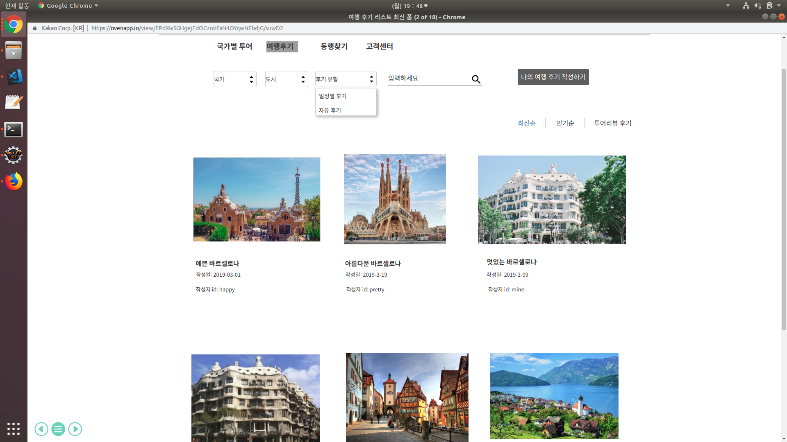
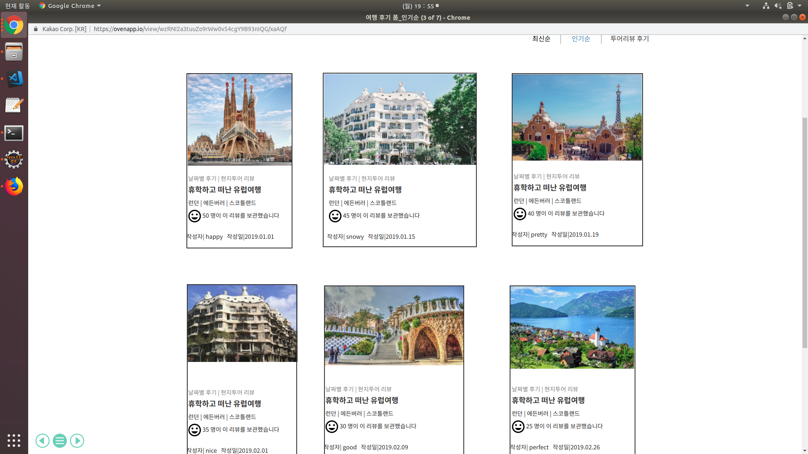
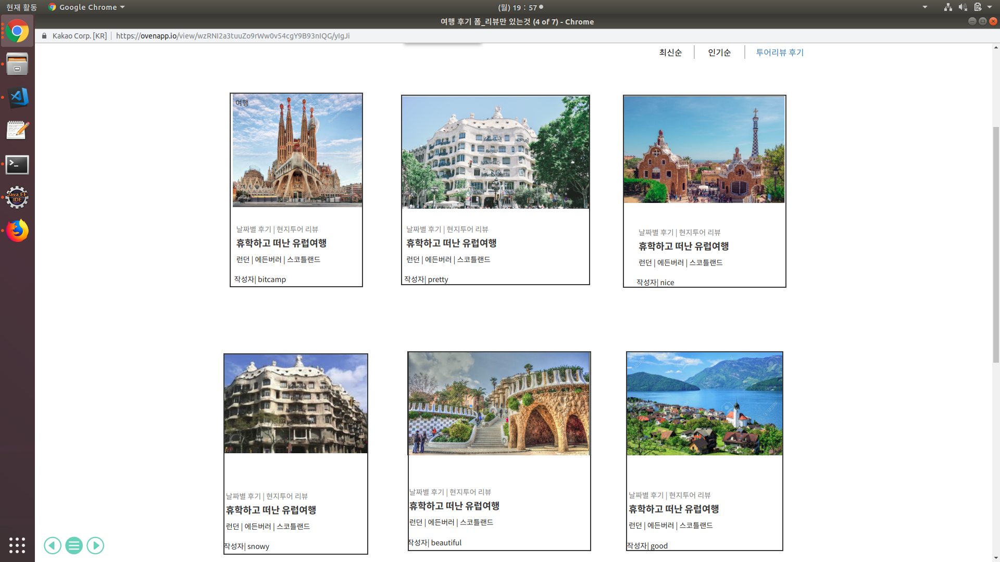
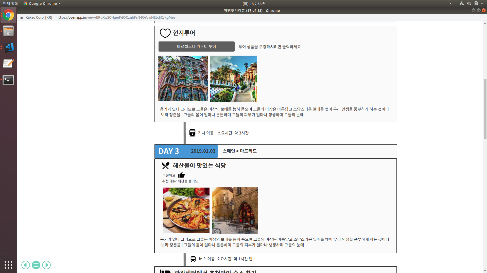

##uc002-여행 후기 상세보기(travel prouct detail) \
고객이 '여행 후기 사진 목록'화면에서 여행 후기 사진 하나를 선택하면 '여행 후기 상세 보기' 화면으로 넘어간다.

## 주액터
- 고객(회원, 비회원)

## 사전 조건
1. 고객(회원, 비회원)
    - '여행 후기 사진 목록' 화면에서 최신순, 인기순, 리뷰만 있는 후기 순 중에서 하나의 항목을 선택하고 
    -  그 선택한 항목에 따라 '여행 후기 사진 ' 하나를 선택해야 한다.
    
    
    
    
 ## 종료 조건

   - 고객이 '여행 후기 상세보기' 화면에서 다른 사람이 쓴 후기를 확인하고 해당 페이지를 나가면 종료된다.

## 여행 후기 상세보기 기본
  -  고객이 '여행 후기 사진' 목록 화면에서  사진을 하나 클릭한다.
  -  그러면 해당 사진에 대한 여행 후기가 작성 되어 있는 '여행 후기 상세보기' 페이지로 넘어간다.
  -  고객은 '여행 후기 상세보기' 페이지에서 해당 사진에 대한 후기를 확인할 수 있다.
  - 자신이 남긴 여행후기에 댓글이 달려있다면 거기에 대댓글을 달수 있다.
\

## 예외 흐름
- 고객이 클릭한 여행 사진에 해당하는 후기가 아닌 다른 지역에 대한 후기가 나오는 경우
- 고객이 다시 올바른 사진을 클릭할 수 있도록 오류 메시지를 띄운후 '여행 후기 사진 목록' 페이지로 자동으로 넘어가게 한다.