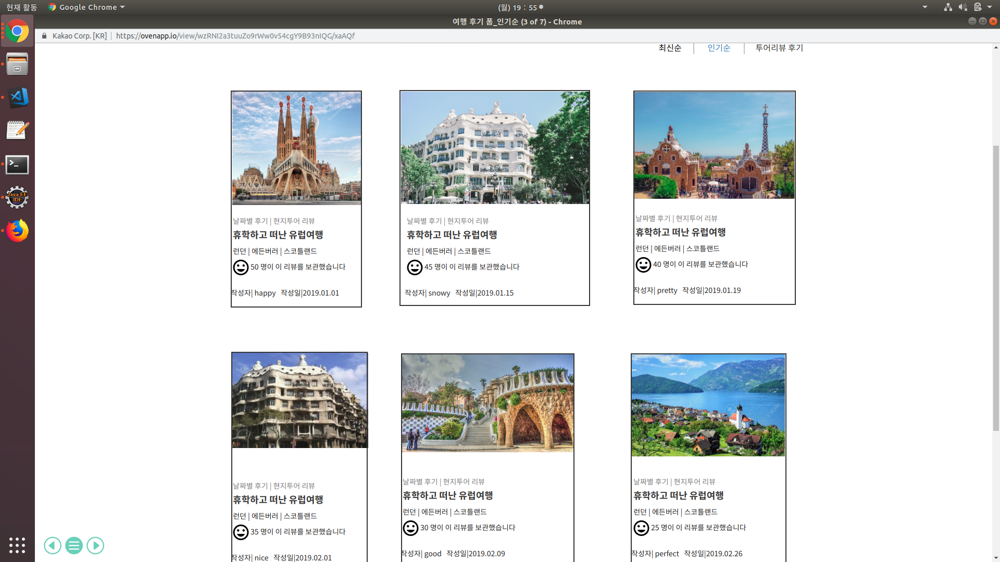
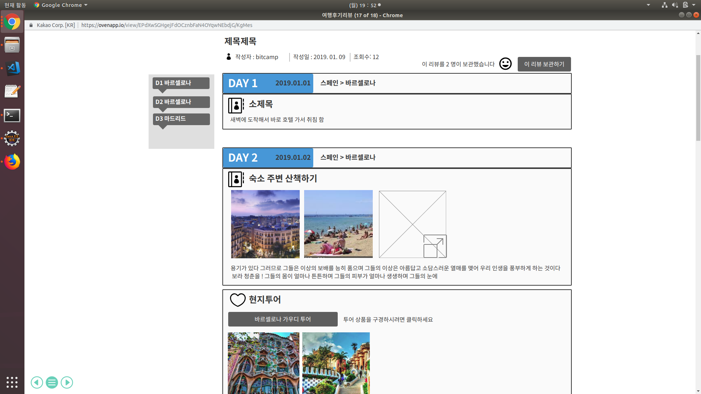
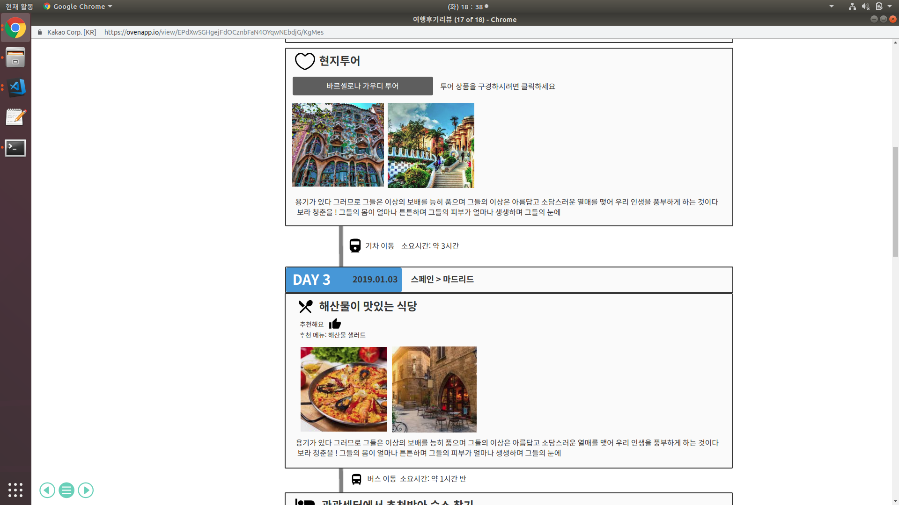

##uc03-여행 후기 조회(search-travel-journal) \
고객이 '여행 후기 사진 목록'화면에서 여행 후기 사진 하나를 선택하면 '여행 후기 상세 보기' 화면으로 넘어간다.

## 주액터
- 고객(회원, 비회원)

## 사전 조건

1. 고객 (비회원)
    - 해당 여행 사이트에 가입이 되어있지 않은 고객은 '메인 폼' 화면에서 '여행후기' 탭을 클릭 해야 한다.
    - '여행 후기 사진 목록' 화면에서 최신순, 인기순, 리뷰만 있는 후기 순 중에서 하나의 항목을 선택하고 
    -  그 선택한 항목에 따라 '여행 후기 사진 ' 하나를 선택해야 한다.
    
    
    

  2. 고객(회원)
   - 해당 여행 사잉트의 계정이 있는 회원의 경우 '메인 폼' 화면에서 로그인 탭을 누른다.
   - 로그인을 한후 '여행후기' 탭을 누르면 여행 사진 후기 리스트를 볼수 있다.
  - '여행 후기 사진 목록' 화면에서 최신순, 인기순, 리뷰만 있는 후기 순 중에서 하나의 항목을     선택하고 
  -  그 선택한 항목에 따라 '여행 후기 사진 ' 하나를 선택해야 한다.
    
    
    

    
 ## 종료 조건
- 고객(회원, 비회원)이 최신순, 인기순, 여행리뷰 후기순 중에서 한개 를 선택해서 그 해당하는 여행 후기 사진을 클릭한다.\
- 고객(비회원, 회원)이 여행 후기 사진을 클릭하게 되면 '여행 후기 상세 조회' 페이지로 이동한다.
- 고객이 '여행 후기 상세보기' 화면에서 다른 사람이 쓴 후기를 확인하고 해당 페이지를 나가면 종료된다.

## 여행 후기 조회 기본
  1. 여행후기 버튼 클릭(회원, 비회원)
1-1.고객이 여행후기 버튼을 쿨릭했을 때 기본적으로 조회되는 여행 후기 사진 리스트는 최신 날짜순으로 조회가 된다. \
1-2. 고객이 최신 날짜순으로 조회가된 여행후기 화면에서 여행후기 사진 한개를 클릭하게 되면 '여행 후기 상세 조회(detail)' 페이지로 넘어간다.
  -  고객이 '여행 후기 사진' 목록 화면에서  사진을 하나 클릭한다.
  -  그러면 해당 사진에 대한 여행 후기가 작성 되어 있는 '여행 후기 상세보기' 페이지로 넘어간다.
  -  고객은 '여행 후기 상세보기' 페이지에서 해당 사진에 대한 후기를 확인할 수 있다.
  - 자신이 남긴 여행후기에 댓글이 달려있다면 거기에 대댓글을 달수 있다.
  

## 시나리오
1. 인기순 버튼 클릭(회원, 비회원)
고객이 비회원인 경우 메인페이지에서 회원가입 버튼을 클릭한다.
회원가입을 완료한후 로그인 버튼을 클릭한다.
로그인을 한후 현지 투어 상품조회 버튼을 클릭한다.
고객이 여행후기 리스트에서 인기순, 투어리뷰 후기순 을 클릭해서 여행 후기 리스트를 조회할수 있다.

- 고객이 여행후기를 '인기순' 조회 버튼을 클릭했을 때 여행 후기 사진은 날짜는 최신이면서 스마일 마크의 개수가 많은 사진 순으로 조회 된다.\
\

이 인기순 후기 목록에서 여행후기 하나를 조회하면 해당 사진에 대한 상세한 여행후기를 조회할수 있는 페이지로 넘어간다.

2. 투어리뷰 후기 순(회원, 비회원)
- 고객이 여행후기를 '투어리뷰 후기순' 조회 버튼을 클릭 했을 때 조회되는 여행 후기 사진 목록은 최신순 이면서 동시에 여행 후기에 대한 리뷰가 남겨져 있는 여행 후기 사진 목록이 조회 된다. \
\

이 투어리뷰순 후기 목록에서 여행후기 하나를 조회하면 해당 사진에 대한 상세한 여행후기를 조회할수 있는 페이지로 넘어간다.

## 예외 흐름
- 고객이 클릭한 여행 사진에 해당하는 후기가 아닌 다른 지역에 대한 후기가 나오는 경우
- 고객이 다시 올바른 사진을 클릭할 수 있도록 오류 메시지를 띄운후 '여행 후기 사진 목록' 페이지로 자동으로 넘어가게 한다.